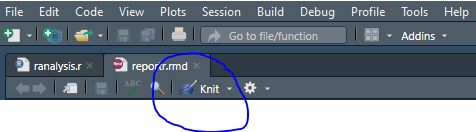

# R Analysis  

View or download the R PDF (Generated with R Markdown): <a href="source/reportr.pdf"> R PDF </a>  
Download RMD file: <a href="source/reportr.rmd"> .RMD file </a> | View from Browser: [.RMD file](https://raw.githubusercontent.com/arcelioeperez/dash-app/gh-pages/source/reportr.rmd)  

Jupyter Notebook Regression: <a href="source/PythonRegression.ipynb">Download PythonRegression.ipynb </a> | [View from Browser](https://github.com/arcelioeperez/dash-app/blob/gh-pages/source/PythonRegression.ipynb)   

Jupyter Notebook PDF: <a href="source/PythonRegression.PDF"> PythonRegression.PDF </a>  

**If you would like to run the `reportr.rmd` file, make sure that you have R, RStudio, and a LaTeX renderer in your computer - i.e. MiniTeX or TinyTeX.**  
**Otherwise you could render an HTML document instead of a PDF.**  

## How to run?  
If you have `RStudio` - just hit `Knit` and the PDF should pop up.  
  

## Differences between Python and R  
I am not going to into the specifics of the languages, but only the differences when running Linear Regressions and Random Forests.  

As you can see R offers a more straight-forward approach to building the models - but it comes with a performance cost.  

### To run a simple regression model in R:  

**Note:** Make sure that if you have categorical data you convert it to `numeric` values.

```
###### Converting to Numeric Variables ###### 
sex <- ifelse(data["sex"] == "female", 0, 1)
smoker  <- ifelse(data["smoker"] == "yes", 1, 0)
region <- as.numeric(data$region)

##### Replacing columns in the Data ###### 
data["sex"] <-  sex
data["smoker"] <-  smoker
data["region"] <- region
```  
### Using the lm() function:  

Response variable: Y (charges)  
Predictor variable: X (age)  
```
#note in R it is allowed to have variable names with `.` in between words
example.model <- lm(charges ~ age, data = data) 
```  

### To get the Summary - use the summary() function:  
```
summary(example)
```
