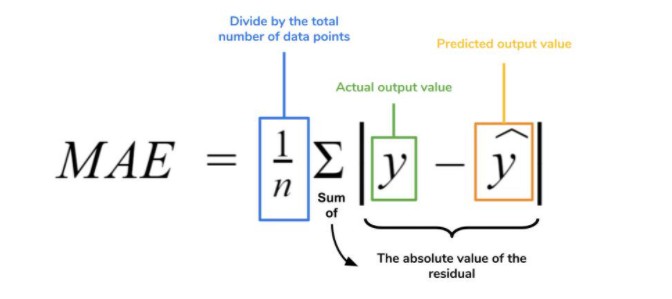
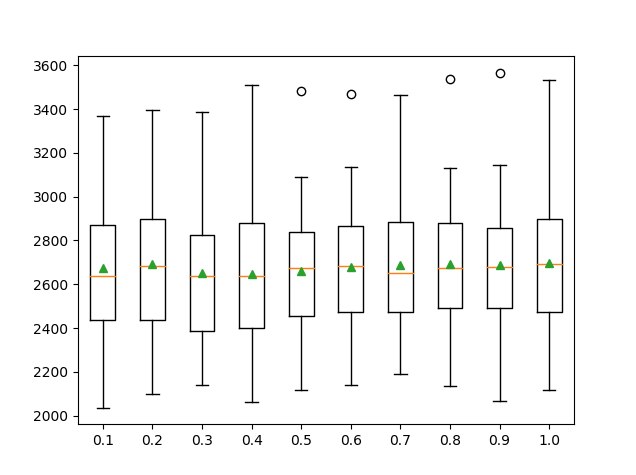
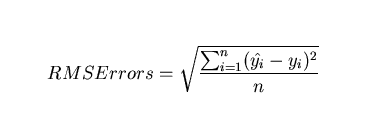

# Linear Regression  
### Variables:  
Age: age of the person  
BMI: body mass index  
Sex: female (0) or male  (1)  
Children: number of children   
Smoker: smoker (1) or non-smoker (0)  
Region: southwest (3), southeast (2), northwest (1), northeast (0)  

## Code To Generate The Chart    
*note: this was generated in the `app.py` program*  
``` python
def update_graph(selected_dropdown):
    
    #dropdown = {'Age':'age', 'Sex':'sex', 'BMI':'bmi', 
    'Children':'children','Smoker':'smoker', 'Region':'region'}
    for i in selected_dropdown: 
        if i == "age": 
            dfx = df["age"]
        elif i == "sex":
            dfx = df["sex"]
        elif i == "bmi":
            dfx = df["bmi"]
        elif i == "children":
            dfx = df["children"]
        elif i == "smoker":
            dfx = df["smoker"]
        else:
            dfx = df["region"]
        dfx = np.array(dfx) 
        dfx = dfx.reshape(-1,1)
        
        #results = evaluate_model(dfx, dataY, model)
        #print("MAE (mean) and MAE (stdev): ", np.mean(results), 
        np.std(results)) 
        model = HuberRegressor() 
        model.fit(dfx, df["charges"])
        x_range = np.linspace(dfx.min(), dfx.max(), 100) 
        y_range = model.predict(x_range.reshape(-1,1))
        figure3 = px.scatter(data,x=df[f"{i}"], y=df["charges"])
        figure3.add_traces(go.Scatter(x=x_range, 
        y=y_range, name = "Regression Fit"))
    return figure3
```  
## Linear Regression Summary (using the 'statsmodels.api' module):  
[Script Used to Generate the Summary](https://raw.githubusercontent.com/arcelioeperez/dash-app/gh-pages/source/p_values.py)  
[Summary](https://raw.githubusercontent.com/arcelioeperez/dash-app/gh-pages/source/regression_stats.txt)  

## What is a Linear Regression?  
>"Simple linear regression lives up to its name: it is a very straightforward simple linear
>approach for predicting a quantitative response Y on the basis of a single predictor varible X" - [ISLR - James, Witten, Hastie, and Tibshirani](http://faculty.marshall.usc.edu/gareth-james/ISL/)  

Mathematical Formula:  
<a href="https://www.codecogs.com/eqnedit.php?latex=Y&space;\approx&space;\beta_{0}&space;&plus;&space;\beta_{1}&space;X" target="_blank"></a>  


# Random Forest  
## What is a Random Forest?  
>
>"Random Forests grow many classification trees. \[...] Each tree gives a classification, and we say the tree 'votes' for that class. The forest chooses the classification having the most votes (over all the trees in the forest)." - [Breiman and Cutler](https://www.stat.berkeley.edu/~breiman/RandomForests/cc_home.htm)
>  

## Code Used To Generate The Model:    
```python
def get_models(): 
    models = dict() 
    #exploting ratios from 10% to 100% 
    for i in arange(0.1, 1.1, 0.1): 
        key = "%.1f" % i 
        #setting the max samples to none 
        if i == 1.0: 
            i = None 
        models[key] = RandomForestRegressor(max_samples = i)
    return models 

def evaluate_model(model, x, y): 
    #defining the evaluation procedure 
    cv = RepeatedKFold(n_splits = 10, n_repeats = 3, 
    random_state = 1) 
    '''
    MAE
    scores = cross_val_score(model, dataX, dataY, 
    scoring = "neg_mean_absolute_error", 
    cv = cv, n_jobs = 1, error_score = "raise")
    '''
    #MSE
    scores = cross_val_score(model, dataX, dataY, 
    scoring = "neg_mean_squared_error", 
    cv = cv, n_jobs = 1, error_score = "raise")

    return np.absolute(scores) 

models = get_models() 
results, names = list(), list() 

for name, model in models.items(): 
    #evaluate the model 
    scores = evaluate_model(model, dataX, dataY) 
    #storing the results 
    results.append(scores) 
    names.append(name) 
    #summarizing the performance 
    '''
    MAE
    print("Mean MAE scores and STD", 
    name, mean(scores), std(scores)) 
    '''
    #RMSE  - getting the square root of the MSE 
    print("RMSE scores and STD", name, 
    mean(np.sqrt(scores)))
    
ans = np.sqrt(results) 

#converting the ans variable to a list in order to plot it with 
#the names list - otherwise it won't run 

ans = list(ans)

#ans is only needed to run the RMSE plot 
#if only running the MAE you don't need the 
#sqrt() function nor the ans variable

plt.boxplot(ans, labels = names, showmeans = True) 
plt.show()
```  
[Citation - Machine Learning Mastery](https://machinelearningmastery.com/random-forest-ensemble-in-python/)  

## Random Forest Results  
[MAE-Random Forest](https://raw.githubusercontent.com/arcelioeperez/dash-app/gh-pages/source/random_forest_mae.txt) | [RMSE-Random Forest](https://raw.githubusercontent.com/arcelioeperez/dash-app/gh-pages/source/random_forest_rmse.txt)  

### Mean Absolute Error  
**Mathematical Formula for MAE:**      
  

>[Mathematical Formula Image from: Dataquest.io](https://www.dataquest.io/blog/understanding-regression-error-metrics/)  
Also, for more information about errors and understanding regression, visit [Dataquest.io](https://www.dataquest.io/blog/understanding-regression-error-metrics/)  

### MAE Plot
  

### Root Mean Squared Error    
**Mathematical Formula for RMSE:**  
  
>[Mathematical Image from: Statweb.stanford.edu](https://statweb.stanford.edu/~susan/courses/s60/split/node60.html)  

### RMSE Plot
  

Download Random Forest Model: [random_forest.py](https://raw.githubusercontent.com/arcelioeperez/dash-app/gh-pages/source/random_forest.py)  

